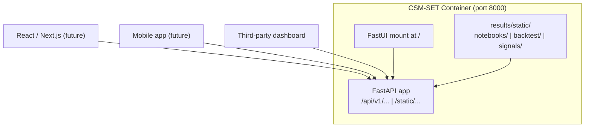

# csm-set

[](https://python.org)
[](LICENSE)
[](https://docs.astral.sh/uv/)
[](pyproject.toml)
[](Dockerfile)
[](https://github.com/lumduan/csm-set/actions/workflows/docker-smoke.yml)
[](https://github.com/lumduan/csm-set/actions/workflows/ci.yml)
[](https://github.com/lumduan/csm-set/pkgs/container/csm-set)

โครงการนี้ใช้กลยุทธ์ Cross-Sectional Momentum บนตลาดหุ้นไทย (SET)
โดยดึงข้อมูลผ่าน [tvkit](https://github.com/lumduan/tvkit) แล้วก็คำนวณ momentum signal → rank หุ้น → backtest → แสดงผลใน dashboard

**Cross-Sectional Momentum strategy for the Stock Exchange of Thailand.**
Headless API + pre-computed research — bring your own frontend.
Powered by [tvkit](https://github.com/lumduan/tvkit), pandas/numpy, and FastAPI.

---

> **⚠️ Disclaimer**
>
> โปรเจกต์นี้จัดทำขึ้นเพื่อการศึกษาเท่านั้น ไม่ถือเป็นคำแนะนำการลงทุนในทุกกรณี
> ผลการทดสอบย้อนหลัง (backtest) ไม่ได้รับประกันผลตอบแทนในอนาคต
> ผู้พัฒนาไม่รับผิดชอบต่อความเสียหายหรือผลกำไรขาดทุนใดๆ ที่เกิดจากการนำโปรเจกต์นี้ไปใช้งาน
>
> **This project is for educational purposes only. It does not constitute investment advice.**
> **Past backtest results do not guarantee future returns.**
> **The developer assumes no responsibility for any losses or damages arising from use of this project.**

---

## Table of Contents

- [What this project does](#what-this-project-does)
- [Quick Start (Public)](#quick-start-public)
- [Architecture (Headless)](#architecture-headless)
- [What you will see](#what-you-will-see)
- [What requires credentials (owner only)](#what-requires-credentials-owner-only)
- [Build your own frontend](#build-your-own-frontend)
- [Owner workflow](#owner-workflow)
- [Module index](#module-index)
- [Where to find X](#where-to-find-x)
- [Troubleshooting](#troubleshooting)
- [Stack](#stack)
- [Development](#development)
- [Project structure](#project-structure)
- [Documentation](#documentation)
- [Contributing](#contributing)
- [References](#references)
- [License](#license)

---

## What this project does

- Computes cross-sectional momentum signals (Jegadeesh–Titman: 12-1M, 6-1M, 3-1M)
- Walk-forward backtest with realistic transaction costs
- Market regime detection via 200-day SMA of the SET index
- Three portfolio construction modes — equal weight, volatility-target, minimum-variance
- FastAPI Data Engine on port 8000 + embedded FastUI dashboard
- Frontend-agnostic JSON data contract with JSON Schema sidecars

**Cross-sectional momentum** (also called relative momentum) ranks stocks within a universe by their past return over a lookback window (typically 12 months, skipping the most recent month to avoid short-term reversal). The strategy buys the top quintile and, in a long-only implementation, weights them equally or by risk target. The approach was first documented by Jegadeesh & Titman (1993) and has been replicated across equity markets globally. This project applies it to the Stock Exchange of Thailand (SET) with Thai-market-specific constraints: minimum ADV of 100M THB, minimum listing of 12 months, and a 200-day SMA regime filter on the SET index. See [docs/concepts/momentum.md](docs/concepts/momentum.md) for the full theoretical background.

---

## Quick Start (Public)

No credentials needed. Just Docker.

```bash
git clone https://github.com/lumduan/csm-set
cd csm-set
docker compose up
```

Open [http://localhost:8000](http://localhost:8000).

The container boots uvicorn in public mode, serves pre-computed research artefacts (notebook HTML, backtest metrics, signal rankings), and exposes the full REST API. Nothing to configure — it just works.

### Pre-built image

Skip the build step entirely with a pre-built image from GHCR:

```bash
docker pull ghcr.io/lumduan/csm-set:latest
docker run -p 8000:8000 ghcr.io/lumduan/csm-set:latest
```

Available tags: `latest`, `vX.Y.Z`, `vX.Y`, `sha-<short-sha>`. See [RELEASING.md](RELEASING.md) for the owner release process.

---

## Architecture (Headless)

CSM-SET is designed as a **Data Engine** on port 8000, not a monolithic dashboard app.

FastUI is one consumer of the API today, but the API and static asset tree are framework-agnostic. Any frontend — React, Next.js, Vue, Flutter, or a third-party dashboard — can consume the same endpoints and JSON artefacts without backend changes.

```
                     ┌──────────────────────────┐
                     │  CSM-SET Container       │
                     │  port 8000  uvicorn      │
                     │  ┌────────────────────┐  │
                     │  │  FastAPI app       │  │
                     │  │   /api/v1/...      │  │◄──── React / Next.js (future)
                     │  │   /static/...      │  │◄──── Mobile app (future)
                     │  │   /                 │  │◄──── Third-party dashboard
                     │  │   (FastUI mount)   │  │◄──── FastUI (today, embedded)
                     │  └────────────────────┘  │
                     │  results/static/         │
                     │   ├── notebooks/         │
                     │   ├── backtest/          │
                     │   └── signals/           │
                     └──────────────────────────┘
```



Port 8000 serves:

- **REST endpoints** under `/api/v1/` — signals, backtest results, portfolio state, notebook listings, health
- **Static artefacts** under `/static/` — notebook HTML, backtest JSON, signal JSON
- **Embedded FastUI dashboard** at `/` — a full working UI with zero extra build steps

Write endpoints (`/api/v1/data/refresh`, `/api/v1/backtest/run`, `/api/v1/scheduler/run/*`, `/api/v1/jobs`) return `403` in public mode with a canonical "Disabled in public mode" response.

---

## What you will see

At `http://localhost:8000`:

| Page | Content |
|------|---------|
| `/` | FastUI dashboard — navigation to notebooks, backtest, signals |
| `/notebooks/01_data_exploration` | Data quality audit: coverage, gaps, distributions |
| `/notebooks/02_signal_research` | Momentum signal analysis: IC, quintile spreads, decay |
| `/notebooks/03_backtest_analysis` | Walk-forward backtest: equity curve, drawdown, turnover |
| `/notebooks/04_portfolio_optimization` | Portfolio construction: weight schemes, regime overlay |
| `/api/v1/signals/latest` | Latest cross-sectional ranking (JSON) |
| `/api/v1/backtest/summary` | Backtest metrics: CAGR, Sharpe, Sortino, max DD |
| `/api/docs` | OpenAPI (Swagger) — explore every endpoint interactively |

---

## What requires credentials (owner only)

Everything visible in public mode works with zero configuration. The following operations require a [tvkit](https://github.com/lumduan/tvkit) setup with TradingView credentials:

| Operation | Requires | Script |
|-----------|----------|--------|
| Fetch live OHLCV data | tvkit + Chrome profile | `scripts/fetch_history.py` |
| Build universe snapshots | fetched data | `scripts/build_universe.py` |
| Re-run notebooks | fetched data | `scripts/export_results.py --notebooks-only` |
| Generate new backtest results | fetched data + signal pipeline | `scripts/export_results.py --backtest-only` |
| Generate new signal rankings | fetched data + feature pipeline | `scripts/export_results.py --signals-only` |

---

## Build your own frontend

`results/static/` is a flat, frontend-agnostic asset tree:

```
results/static/
├── notebooks/                    # nbconvert HTML (no code cells)
├── backtest/
│   ├── summary.json              # CAGR, Sharpe, Sortino, max DD, win rate
│   ├── summary.schema.json       # JSON Schema draft-2020-12
│   ├── equity_curve.json         # NAV indexed to 100 (no raw prices)
│   ├── equity_curve.schema.json
│   ├── annual_returns.json
│   └── annual_returns.schema.json
└── signals/
    ├── latest_ranking.json       # Symbol, sector, quintile, z-score, rank %
    └── latest_ranking.schema.json
```

Every `<name>.json` carries `"schema_version": "1.0"` and a sibling `<name>.schema.json`. Generate TypeScript types in one command:

```bash
npx json-schema-to-typescript results/static/backtest/summary.schema.json \
  -o frontend/types/backtest.ts
```

Then fetch live data from the API:

```javascript
const rankings = await fetch('http://localhost:8000/api/v1/signals/latest')
  .then(r => r.json());
// rankings.rankings: Array<{ symbol, sector, quintile, z_score, rank_pct }>
```

**CORS is preconfigured.** In public mode, `CSM_CORS_ALLOW_ORIGINS` defaults to `*`. In private mode, restrict it to your dev server (e.g., `http://localhost:3000,http://localhost:5173`) via the `docker-compose.private.yml` override.

No raw OHLCV fields (`open`, `high`, `low`, `close`, `volume`, `adj_close`) appear in any JSON artefact or API response. This is enforced by automated boundary audit tests.

---

## Owner workflow

If you have tvkit credentials and want to refresh the public research:

```bash
cp .env.example .env
# Set CSM_PUBLIC_MODE=false and add your tvkit credentials
```

### Via Docker (recommended)

```bash
docker compose -f docker-compose.yml -f docker-compose.private.yml up -d
docker compose exec csm bash

# Inside the container:
uv run python scripts/fetch_history.py      # Pull OHLCV via tvkit
uv run python scripts/build_universe.py     # Build monthly snapshots
uv run python scripts/export_results.py     # Notebooks → HTML, backtest + signals → JSON
exit

# Back on the host:
git add results/static/
git commit -m "results: refresh $(date +%Y-%m-%d)"
git push
```

### Via local uv

```bash
uv sync --all-groups

uv run python scripts/fetch_history.py
uv run python scripts/build_universe.py
uv run python scripts/export_results.py

git add results/static/
git commit -m "results: refresh $(date +%Y-%m-%d)"
git push
```

Public users get the updated research on their next `git pull` or image rebuild.

---

## Module index

| Path | Purpose |
|------|---------|
| `src/csm/data/` | tvkit loader, parquet store, universe builder, price cleaning, dividend adjustment |
| `src/csm/features/` | Momentum signals, risk-adjusted momentum, sector features, feature pipeline |
| `src/csm/portfolio/` | Weight optimisation (equal, vol-target, min-variance), constraints, rebalancing, drawdown breaker |
| `src/csm/research/` | Cross-sectional ranking, IC analysis, walk-forward backtest engine |
| `src/csm/risk/` | Risk metrics (Sharpe, Sortino, max DD), market regime detection |
| `src/csm/execution/` | Trade-list generation, execution simulation, slippage models |
| `src/csm/config/` | Settings (pydantic-settings), constants, timezone-aware configuration |
| `api/` | FastAPI app factory, routers, security middleware, error handling, static file serving |
| `ui/` | FastUI dashboard pages (mounted on the FastAPI app) |
| `scripts/` | Owner utilities: fetch OHLCV, build universe, export results |
| `tests/` | Unit + integration tests (mirrors `src/csm/` and `api/` layout) |
| `docs/` | Architecture, reference, guides, getting-started, development, plans |
| `results/static/` | Pre-computed artefacts: notebook HTML, backtest JSON, signal rankings |

---

## Where to find X

| I want to ... | Look at |
|---------------|---------|
| understand the data flow | [docs/architecture/overview.md](docs/architecture/overview.md) |
| extend a momentum signal | `src/csm/features/momentum.py` |
| add a portfolio constraint | `src/csm/portfolio/optimizer.py` and `src/csm/portfolio/construction.py` |
| configure timezone or env vars | `src/csm/config/settings.py` and `.env.example` |
| run the quality gate | [docs/development/overview.md](docs/development/overview.md) § Quality gate |
| refresh public artefacts | `scripts/export_results.py` and [docs/guides/public-mode.md](docs/guides/public-mode.md) |
| release a new version | [RELEASING.md](RELEASING.md) |
| see all API endpoints | [http://localhost:8000/api/docs](http://localhost:8000/api/docs) (when running) |
| understand the security model | [docs/architecture/overview.md](docs/architecture/overview.md) § Security model |
| add an API endpoint | `api/routers/` and [docs/reference/](docs/reference/) |
| find a module's public API surface | [docs/reference/](docs/reference/) — one page per subpackage |

---

## Troubleshooting

### Port 8000 already in use

**Symptom:** `docker compose up` fails with `bind: address already in use`.

**Fix:** Stop the process on port 8000 (`lsof -ti:8000 | xargs kill`) or set `CSM_PORT=8001` in `.env` and remap the compose port.

### Docker daemon not running

**Symptom:** `Cannot connect to the Docker daemon`.

**Fix:** Start Docker Desktop (macOS/Windows) or `sudo systemctl start docker` (Linux).

### Private mode: missing tvkit authentication

**Symptom:** `scripts/fetch_history.py` exits with `TVKitAuthError` or `No credentials found`.

**Fix:** Ensure your TradingView credentials are set in `.env` (see `.env.example`) and that your Chrome profile directory is correctly mounted in the private compose file.

### Permission denied writing to `data/` or `results/`

**Symptom:** Script fails with `PermissionError` when writing Parquet or JSON files.

**Fix:** The private compose file mounts `data/` and `results/` as writable. If running locally without Docker, ensure the directories exist and are writable by your user: `mkdir -p data/raw results/static`.

### Container exits with OOM (out of memory)

**Symptom:** Container stops silently during `nbconvert` or backtest computation.

**Fix:** The public compose file sets `mem_limit: 2g`. If you have many notebooks or a long backtest horizon, increase it (`mem_limit: 4g`) or run `scripts/export_results.py` locally where memory is unconstrained.

### `uv sync` fails with missing Python version

**Symptom:** `uv sync` complains `No Python installation found for request 3.11+`.

**Fix:** Install Python 3.11+ via `uv python install 3.12` or your system package manager. Verify with `uv python list`.

---

## Stack

| Concern | Technology |
|---------|------------|
| Data ingestion | tvkit, pyarrow, pandas |
| Research | numpy, scipy, scikit-learn |
| API | FastAPI, uvicorn, APScheduler |
| UI | NiceGUI (FastUI, mounted on FastAPI) |
| Config | pydantic-settings |
| Tooling | uv, ruff, mypy, pytest |

---

## Development

```bash
uv sync --all-groups
cp .env.example .env

# Quality gate — run before every commit:
uv run ruff check .
uv run ruff format --check .
uv run mypy src/
uv run pytest tests/ -v

# Run API + UI locally:
uv run uvicorn api.main:app --reload --port 8000
uv run python ui/main.py
```

---

## Project structure

```
csm-set/
├── api/                          # FastAPI app, routers, middleware, schemas
├── src/csm/                      # Core library: config, data, signals, portfolio, backtest, risk
├── ui/                           # FastUI views (mounted on the FastAPI app)
├── scripts/                      # Owner utilities: fetch_history, export_results, build_universe
├── notebooks/                    # Jupyter research notebooks (Thai markdown, English code)
├── tests/                        # Test suite (unit + integration)
├── results/                      # Pre-computed research artefacts (committed)
│   └── static/                   # Frontend-agnostic JSON + HTML + Schema sidecars
├── data/                         # Raw/processed Parquet files (gitignored)
├── docs/                         # Documentation and plans
├── Dockerfile                    # Multi-stage: builder + slim runtime
├── docker-compose.yml            # Public: port 8000, results:ro, healthcheck, mem_limit 2g
├── docker-compose.private.yml    # Owner override: writable mounts, tvkit auth
└── pyproject.toml                # Project metadata, dependencies, tool config
```

---

## Documentation

- [Getting Started](docs/getting-started/overview.md)
- [Architecture Overview](docs/architecture/overview.md)
- [Docker Guide](docs/guides/docker.md)
- [Public Mode Guide](docs/guides/public-mode.md)
- [Momentum Concept](docs/concepts/momentum.md)
- [Development Guide](docs/development/overview.md)
- [Reference: Data Layer](docs/reference/data/overview.md)
- [Reference: Features](docs/reference/features/overview.md)
- [Reference: Portfolio](docs/reference/portfolio/overview.md)
- [Reference: Research](docs/reference/research/overview.md)
- [Reference: Risk](docs/reference/risk/overview.md)
- [API Reference (OpenAPI)](http://localhost:8000/api/docs) — available when the container is running
- [Master Roadmap](docs/plans/ROADMAP.md)

---

## Contributing

Contributions are welcome. Please read the following before opening a PR:

- [Contributing Guide](CONTRIBUTING.md) — setup, workflow, and PR expectations
- [Development Guide](docs/development/overview.md) — quality gate, commit conventions, code style
- [Code of Conduct](CODE_OF_CONDUCT.md)
- [Security Policy](SECURITY.md) — how to report vulnerabilities responsibly
- [Releasing](RELEASING.md) — versioning and release process

---

## References

- Jegadeesh & Titman (1993). *Returns to Buying Winners and Selling Losers*
- Asness, Moskowitz & Pedersen (2013). *Value and Momentum Everywhere*
- Rouwenhorst (1999). *Local Return Factors in Emerging Stock Markets*

---

## License

MIT — see [LICENSE](LICENSE)
