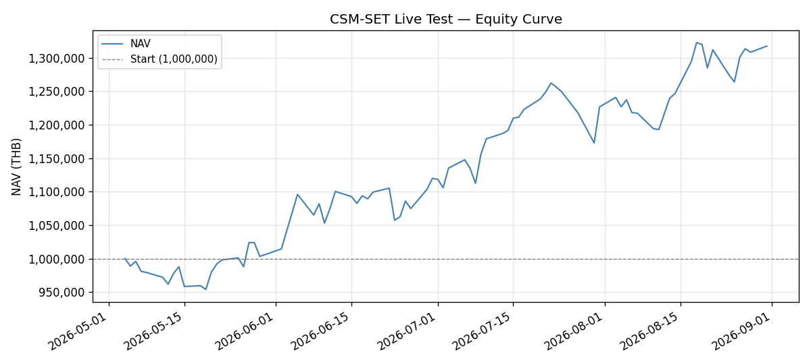
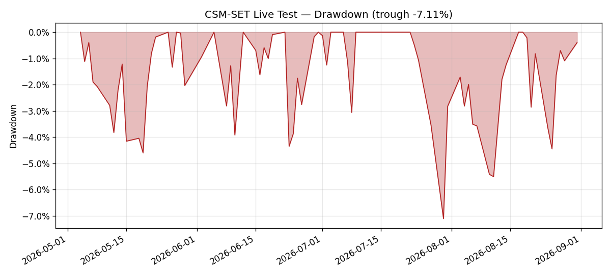
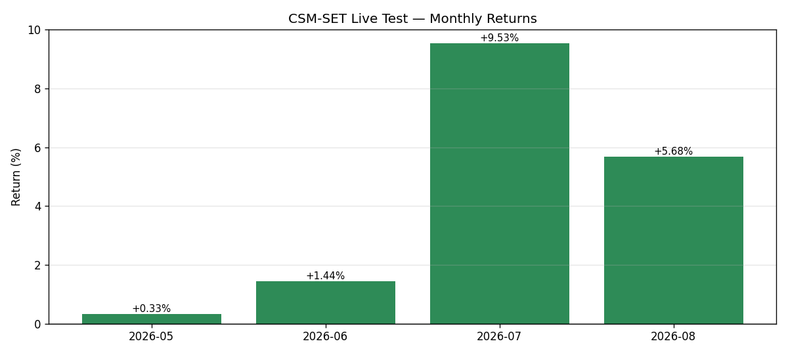
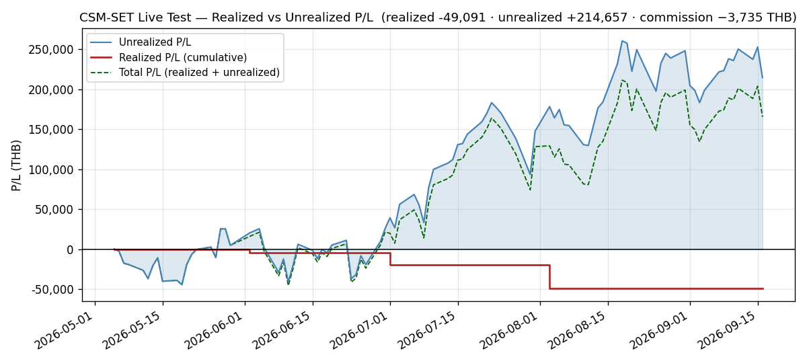

# Monthly Review — 2026-08 (August)

**Period:** August 2026 (live-test month 4, 20 trading days, Aug 3–31; Aug 12 was the month's only market closure)
**Phase:** B — Execution & Observation — **and August closes Phase B.** From 2026-09-01 the live test is in **Phase C (September–October)**.
**Status:** NAV closed August at **1,317,530.70 THB**. The reported change is **+90,790.35 (+7.40%)**, but **20,000.00 of that is injected capital, not performance** — the month's **time-weighted return is +5.68%**, and that is the figure the charts and every comparison in this review use. Cumulative return on the rebased 1,120,000 capital base is **+17.64%**. **The September book is a 0-out / 0-in rotation: no trades at the 2026-09-01 ATO** — the live test's first no-trade rebalance, and the first month `configs/live_portfolio.yaml` will not change at a rebalance. All three exit rules fire on **zero** holdings. August was a month of two halves in every dimension: **10 up days and 10 down days**, an annualized realized vol of **30.88%**, the largest single-session gain of the live test (**+47,762.00** on 08-17) and its third-largest loss (**−39,178.00** on 08-24) seven sessions apart, an all-time NAV high of **1,329,825.70** on 08-18, and a **−4.73%** intra-month drawdown. The month's most consequential events were not in the P&L: **four of the ten holdings went ex-dividend in five sessions**, taking vendor-restatement scope from 2 to **6 of 10 names** and producing a fully-characterised model of three long-standing gateway reporting defects.

---

## Executive Summary

August opened on the 2-out/2-in rotation executed at the August 3 ATO (SELL DELTA + PTTGC, BUY SMT + MGC) — the plan drafted in `monthly/2026-07.md` — which required a **20,000.00 THB capital injection** because the ATO printed SMT at 5.80 against a 4.78 indicative. The book then ran **1,226,740.35 → 1,199,142.70 (trough, Aug 11) → 1,329,825.70 (all-time high, Aug 18) → 1,317,530.70 (close)**: a −2.25% opening fortnight, a +10.90% ten-session advance, and a −0.92% give-back that leaves the month **0.92% below its own peak**.

**The month's headline number is its least informative statistic**, and more so than in any prior month. Two sessions — 08-17 (+47,762.00) and 08-18 (+28,814.00) — contributed **+76,576.00**, which is **108% of the month's entire time-weighted gain**. Strip them and August is a losing month. The 50% up-day hit rate and 30.88% annualized vol describe a book that moved a great deal and arrived close to where the middle of the month found it.

**Breadth at the position level was wide and one-sided at both ends.** KCE (+45.91% → **+54.87%**) and IRPC (+8.52% → **+16.33%**) were the month's engines; **MGC fell to −28.62%**, its worst since entry, and is the only holding that has never traded above its entry price. The dispersion between the two 2026-08-03 entrants — SMT **+5.00%**, MGC **−28.62%** — reached **33.62 pp**, a live-test record, on names bought the same morning by the same rule at the same notional intent.

**The most important thing that happened in August was a data-integrity finding, not a return.** Four ex-dividend events in five sessions (KCE 08-24, INSET 08-25, MGC 08-26, **none 08-27**, FORTH 08-28) rewrote the platform's banked price history through the vendor's backward adjustment. The 08-27 gap in that sequence turned out to be the most valuable session of the month: **with no corporate action in the window it acted as a control**, isolating two superimposed causes in `daily_return` that three prior sessions could only describe. The resulting two-defect model was then **confirmed out-of-sample** on 08-28 and again on 08-31, predicting the behaviour of `daily_return`, `cumulative_return` and `combined_drawdown` correctly on a dirty session and two clean ones. See `events/2026-08-24-ex-dividend-restatement-wave.md`.

---

## Performance Metrics

| Metric | Value | Target / Baseline | Status |
|---|---:|---|---|
| Month-open NAV (Jul 31 close) | 1,226,740.35 | — | — |
| Month-close NAV | **1,317,530.70** | — | matches the 2026-08-31 daily log exactly |
| Reported month change | +90,790.35 (**+7.40%**) | — | ⚠️ **includes +20,000 injected capital** |
| Ex-injection change | +70,790.35 (+5.77%) | — | divides by the pre-injection base |
| **Time-weighted return** | **+5.68%** | — | ✅ **the figure to quote and chart** |
| Cumulative return (rebased 1,120,000 base) | **+17.64%** | — | ✅ |
| Annualized Sharpe (daily, ×√252, n=80) | **2.694** | backtest 0.663 | ⚠️ 4-month sample — not comparable |
| Realized daily vol (Aug) | 1.95% (**30.88%** ann.) | 15% vol target | ⚠️ above target; vol-scaling overlay not active in the live test |
| Max drawdown since inception | **−7.11%** (2026-07-30) | backtest −31.03% | ✅ |
| August max drawdown | −4.73% (08-25 vs the 08-18 peak) | — | ✅ |
| Up / down sessions | **10 / 10** (50.0%) | — | — |
| **Turnover — September plan** | **0.00%** | ≤180% p.a. | ✅ **no trades** |
| Turnover — August executed (08-03) | 16.09% (Σ\|Δw\| 32.18%) | ≤180% p.a. | ✅ |
| Sector concentration (max) | ENERG **32.41%** | ≤35% | ✅ no breach |
| Position bound (max) | INSET **15.24%** | 5–15% | ⚠️ **outside — see Drawdown & Risk** |
| Data completeness | 20/20 sessions | 100% | ✅ `failures=0` on every refresh |

**On the Sharpe figure.** 2.694 against a backtest baseline of 0.663 is **not** evidence the live book is four times better. It is 80 daily observations spanning a single strong regime; the backtest number is a multi-year walk-forward through several. **The honest statement is that four months is too short to estimate a Sharpe**, and the figure is reported because the skill asks for it, with that caveat attached rather than omitted.

---

## Performance vs Backtest Baseline

| Measure | Live (4 months) | Phase 3.8 real-data backtest | Read |
|---|---:|---:|---|
| Return | +17.64% cumulative | CAGR **12.52%** | ahead, but on a 4-month window inside one BULL regime |
| Sharpe | 2.694 (n=80) | **0.663** | not comparable at this sample size |
| Max drawdown | **−7.11%** | **−31.03%** | ✅ the live book has not yet been tested by anything resembling the backtest's worst |
| Turnover | 16.09% (Aug), 0% (Sep plan) | ≤180% p.a. | ✅ comfortably inside |

**The concentrated ~10-name live configuration is a higher-variance expression of the validated edge, not the validated edge itself.** The Phase 3.8 baseline is the **broad top-quantile book** (notebook 03); notebook 04's concentrated 10-stock figures are on **synthetic** data and are not a baseline. Reading a 4-month, 10-name, 30.88%-vol live result against a multi-year, wide-book backtest is a category comparison — it is reported for continuity, and **the only line in this table that currently carries information is the drawdown one**, because −7.11% against −31.03% says the live book has not yet met a hostile regime.

---

## Rebalance (September 1 ATO) — 0-out / 0-in, no trades

**Evaluation date:** 2026-08-31 (last trading day of August). **Execution date:** 2026-09-01 (Tuesday) ATO — confirmed a trading day against the banked 20-closure SET calendar; the next 2026 closure is 2026-10-13.

### Ranking inputs (reproduced from the engine)

- Composite = equal-weight mean of the z-scored feature columns (`mom_12_1`, `mom_6_1`, `mom_3_1`, `mom_1_0`, `sharpe_momentum`, `residual_momentum`) — what `PortfolioConstructor.select` averages (`construction.py:69`, `cross_section.mean(axis=1)`); percentile rank is `composite.rank(pct=True)` (`construction.py:102`).
- **204 ranked symbols** at 2026-08-31, from `features_latest.parquet` (stamped 2026-08-31 18:01 by the scheduled refresh, `failures=0`, 211 symbols fetched, `index_fetched=true`) — the same cross-section width July ranked against.
- Exit rules: rank floor **0.35** (unconditional), buffer **0.25** (`best_replacement_rank − current_rank ≥ 0.25`, `construction.py:154-158`), **EMA100** fast exit, liquidity floor **5,000,000 THB** 63-day ADTV on any incoming name, sector cap **35%**.

> **A note on the ranking source, because it looks alarming and is not.** `results/signals/latest_ranking.json` is stamped `generated_at 2026-04-29` and is **four months stale** — but it is a **signal-IC evaluation artifact committed at repo bootstrap**, not a per-symbol ranking, and **nothing reads it at rebalance**. The live ranking is computed from the feature panel, exactly as the July review did. No regeneration was required and none was run.

### Current holdings — composite percentile rank (Aug 31)

| Holding | Universe rank | Composite pct-rank | Below 0.35 floor? | Challenger gap ≥ 0.25? | Close < EMA100? |
|---|--:|--:|---|---|---|
| SMT | 2 | 0.995 | no | no (+0.005) | no (6.10 vs 3.7696, +61.8%) |
| MGC | 3 | 0.990 | no | no (+0.010) | no (7.65 vs 7.0148, +9.1%) |
| GUNKUL | 4 | 0.985 | no | no (+0.015) | no (5.15 vs 4.1508, +24.1%) |
| INSET | 8 | 0.966 | no | no (+0.034) | no (4.78 vs 3.8387, +24.5%) |
| EPG | 15 | 0.931 | no | no (+0.069) | no (6.25 vs 5.2375, +19.3%) |
| IRPC | 16 | 0.926 | no | no (+0.074) | no (2.68 vs 1.9955, +34.3%) |
| EASTW | 18 | 0.917 | no | no (+0.083) | no (4.86 vs 4.3573, +11.5%) |
| KCE | 20 | 0.907 | no | no (+0.093) | no (60.50 vs 39.2870, +54.0%) |
| FORTH | 38 | 0.819 | no | no (+0.181) | no (16.00 vs 13.9403, +14.8%) |
| HANA | 39 | 0.814 | no | no (+0.186) | no (47.25 vs 35.9995, +31.3%) |

**`PortfolioConstructor.select()` verdict (n=10, floor 0.35, buffer 0.25): 0 evicted, 10 retained.** No holding breaches the 0.35 rank floor — **the lowest is HANA at 0.814**, which is not merely inside the floor but in the top 19% of the universe. The best eligible challenger is **ML at 1.000**, so the buffer threshold bites at any holding ranked below **0.750**; **no holding is below it**, and the closest (HANA) clears by **+0.0637**. **All ten holdings are above their EMA100**, the closest being MGC at **+9.06%**.

### Recommended September book — no change

**SELL: none. BUY: none. Turnover: 0.00%.** The book carries into September unchanged: IRPC, HANA, GUNKUL, INSET, KCE, EASTW, EPG, FORTH, SMT, MGC — same ten names, same share counts, same 3,027.70 of cash.

**This is a result, not an absence of one.** The N-out/N-in count is emergent — it is however many holdings trip the exit rules — and this month that is zero. **The three prior rotations (3-out/3-in, 1-out/1-in, 2-out/2-in) all fired because something broke a rule; nothing did in August.** No trade list is issued and `configs/live_portfolio.yaml` is **not** edited: there are no fills to record, and for the first time the file remains valid across a rebalance.

🔴 **This settles the standing "is MGC carried?" question by rule rather than by argument, and the answer is counter-intuitive enough to state plainly.** MGC is the book's worst position at **−28.62%** and the only name never to have traded above its entry price — and it ranks **#3 of 204 (pct 0.990)**. **A cross-sectional momentum rank and a position's entry price are different quantities, and only the first is an input to the model.** The system is not "ignoring" the loss; the loss is simply not something the ranking is a function of. MGC is retained by all three rules with room to spare, and the daily logs' repeated observation that "no rule evicts MGC" is now confirmed at the one moment the rules are actually evaluated.

### ⚠️ A composite-definition discrepancy — no effect this month, recorded because it is one rung from mattering

The live feature panel carries **seven** factor columns; the composite documented in `monthly/2026-07.md` and reproduced above is **six**. The seventh, `sector_rel_strength` (= `mom_12_1(symbol) − mom_12_1(sector)`), is designed as an **entry gate** — `rs_filter_mode: entry_only` builds it into an `entry_mask` at `backtest.py:617` — **not** as a composite factor. But `cross_section = feature_panel.xs(current_date, level="date")` (`backtest.py:578`) feeds `select()` **whatever columns the panel holds**, so a live invocation would silently average all seven.

| Basis | Lowest-ranked holding | Margin over the 0.750 buffer threshold |
|---|---|---|
| **Six-factor** (July precedent, used above) | HANA **0.814** | **+0.0637** |
| Seven-factor (all panel columns) | HANA **0.760** | **+0.0098** |

**The verdict is 0-out / 0-in on either basis, so September's trade list is unaffected.** But under the seven-factor reading **HANA survives eviction by one percentile point**, and KCE and FORTH also re-order materially (KCE 0.907 → 0.853, FORTH 0.819 → 0.863). **A definitional ambiguity that changes no decision this month would have changed one at a 0.01 different threshold**, which is precisely when it should be resolved rather than after it bites. Filed as an open engine question; the six-factor composite is used here because it is the documented precedent and what the last executed rotation ranked on.

---

## P/L Split

| Metric | This month | Since inception |
|--------|----------:|----------------:|
| Realized P/L | **−29,775.45** | **−49,091.38** |
| Unrealized P/L | **+100,566.46** | **+248,232.35** |
| **Total P/L** | **+70,791.01** | **+199,140.97** |
| Commission paid | **682.65** | **−3,735.16** |

- **Realized moved this month because August contained a rotation** — the 2026-08-03 execution banked **−29,775.45** (DELTA −14,392.42, PTTGC −15,383.03). **September's rotation will not move it**, because September has no trades.
- **Commission ledger:** 1,611.15 (05-05) · 984.44 (06-02) · 169.09 (06-04/05) · 287.83 (07-01) · **682.65 (08-03)** = **3,735.16** cumulative.
- **Commission is already inside the other rows** — buy-side capitalised into cost basis, sell-side netted out of realized. Never subtract it from NAV a second time.
- **Quote commission against both denominators.** Cumulative 3,735.16 is **0.28% of NAV**, which reads as free; it is **7.6% of the 49,091.38 cumulative realized loss**, which does not. Rotation friction scales with turnover, not book size — and **September's 0% turnover is the cheapest possible month by construction.**
- **A negative cumulative realized (−49,091.38) alongside a positive total (+199,140.97) is the design working.** A momentum book banks its losers at rebalance and lets winners ride. Escalate only if the *total* stalls; it advanced +70,791.01 this month.

**Reconciliation, and a check that earns its place.** The month's total P/L change is **+70,791.01**; the ex-injection NAV change is **+70,790.35**. The **0.66 THB** difference is exactly the P/L residual's step at the 2026-08-03 rotation (**1,609.61 → 1,610.27**, caused by the two entrants' 4-dp `avg_cost` rounding). **Two independently-derived figures agreeing to within a known, previously-documented artifact is stronger evidence than either alone**, and it is why the residual is tracked rather than rounded away.

**P/L identity:** `realized_cum + unrealized − (NAV − starting_nav)` = −49,091.38 + 248,232.35 − 197,530.70 = **1,610.27 THB**, held constant on all 20 August sessions. ⚠️ **Note for the next reviewer: this skill's step-10 text still says the identity equals 1,609.61 "constant".** That was true through 2026-07-31 and **stepped at the 2026-08-03 rotation**; verify against **1,610.27** until the next rotation steps it again.

---

## Drawdown & Risk

| Metric | Value | Threshold | Status |
|---|---:|---|---|
| Drawdown at month-close | **−0.92%** (vs the 08-18 peak 1,329,825.70) | — | ✅ shallowest since 08-21 |
| August max drawdown | **−4.73%** (08-25) | — | ✅ |
| Max drawdown since inception | **−7.11%** (2026-07-30) | −10% circuit breaker | ✅ never approached |
| Circuit breaker | **Inactive** | trips at **1,064,000** (5% of 1,120,000) | ✅ buffer **+253,530.70 / 19.24%** |
| Sector concentration | ENERG 32.41% · ETRON 32.14% | ≤35% | ✅ no breach |
| Position bound | **INSET 15.24%** | 5–15% | 🔴 **OUTSIDE** |
| Sector floor | **AUTO 5.34%** | ≥5% | ⚠️ 0.34 pp of headroom |
| Liquidity | all 10 clear the 5M ADTV floor | ≥5,000,000 THB | ✅ |

🔴 **INSET is outside the position bound and the systematic rules produce no action — recorded, deliberately, as no-action.** INSET closed at **15.2376% of NAV, 3,130.40 THB over** the 197,629.61 ceiling, having been outside the 5–15% band on **nineteen of twenty sessions** since the rotation. **No discretionary trim is recommended and none has been sized.** The live test's value comes from executing the systematic rules without override; a hand-placed trim here would be a model deviation requiring its own event report, and would contaminate the very comparison this test exists to produce. **The bound is documented in `configs/live-settings.yaml` (`max_position: 0.15`) but is applied at rebalance *construction* only — there is no code path that trims drift, and a constraint evaluated only by a human reading a daily log is not a constraint.**

⚠️ **The two-sided version of that question is now live and moving faster than the monthly cadence can see.** **AUTO fell to 5.3418%**, a seventh consecutive holding-period low, leaving **0.34 pp** above the 5% floor after closing 64% of that distance in ten sessions. Separately, the **ENERG–ETRON sleeve gap collapsed to 0.2625 pp** on the final session, having run 1.19 → 0.50 → 1.09 → 0.26 pp across four sessions on an unchanged share register. **A measure that moves 0.8 pp in a session cannot be governed by a check that runs once a month.** The open question — *does the 5–15% band and the 35%/5% sector envelope govern drift, or only construction?* — is carried into September unresolved, now with instances at **both** ends.

**Concentration is genuine, not arithmetic.** The top two sleeves hold **64.55% of NAV** between them and the top four positions (INSET, ENERG's IRPC/GUNKUL, ETRON's KCE) hold **50.7%**. That is the intended shape of a ~10-name concentrated book and is why its realized vol (30.88% annualized) runs at twice the 15% target the vol-scaling overlay would enforce if it were active. **It is not active in the live test**, and this review records that as a standing configuration difference from the backtest rather than a defect.

---

## Regime Summary

| Indicator | Jul 31 | Aug 31 | Change |
|---|---:|---:|---|
| SET Index | 1,623.64 | **1,595.16** | −28.48 (**−1.75%**) |
| SET 200-day SMA | 1,418.32 | **1,449.6623** | +31.34 (+2.21%) |
| Cushion (SET vs SMA200) | +14.48% | **+10.04%** | **−4.44 pp** |
| Regime | BULL | **BULL** | no transition |

**No regime transition occurred and none was close.** The book stayed in BULL on all 20 sessions. **But the cushion compressed −4.44 pp, its largest monthly compression of the live test, and the mechanism changed inside the month.** For most of the period the compression was driven by a *rising mean* absorbing a flat index — the SMA200 climbed +2.21% while the index fell only −1.75%. **In the final week the index took over**: 08-28 alone removed 0.97 pp. At +10.04% the SET would need to shed roughly **146 points** to reach its SMA200, against ~205 a month ago.

**The regime filter is evaluated at the month-end rebalance and was evaluated tonight**: BULL, no action, no equity scaling. There is no intra-month regime check by design. **Six consecutive weeks of cushion compression is a direction worth naming even though nothing in the system acts on it yet** — the first thing that would act is a BULL→BEAR crossing, and at 146 points of headroom that is not a September concern.

---

## Charts

All four were regenerated at this month-end from the three committed input CSVs (`nav_actual.csv`, `nav_twr.csv`, `pnl.csv`), which are committed alongside them as the provenance.

🔴 **The August rebuild was the first that had to chain TWO capital-flow scale factors, and getting it wrong would have silently republished a wrong June bar.** `nav_twr.csv` neutralises **both** injections — `k₁ = 0.9087563918` from 2026-06-05 (the 100,000 MCOT injection) and `k₂ = 0.9839712855` from 2026-08-03 (the 20,000 rotation shortfall), applied as `k₁ × k₂` from 08-03 onward. Neither factor was re-derived from current NAV, per the standing instruction in `graphs/README.md` — which matters more than usual this month, because the 2026-08-03 `equity_curve` anchor that `k₂` was originally derived from **has since been restated** (1,247,760.70 → 1,240,806.78) by the FORTH ex-dividend adjustment. **Re-deriving it would have moved a published historical figure to chase a number that itself moved.**

**Verified before publishing:** the monthly-returns bars read **May +0.33% · Jun +1.44% · Jul +9.53% · Aug +5.68%**, and the three prior bars are **identical to the values previously published**. The same rebuild run against `nav_actual.csv` instead produces **Jun +11.62%** — the exact documented failure mode — which is why the TWR series is the one that reaches the chart. The equity curve ends at **1,317,530.70** on 2026-08-31, matching the final daily log, and the drawdown chart's trough label reads **−7.11%**. All four were checked against the rendered images, not only the generators' stdout.

---

## Notes / Data Quality

**Infrastructure was materially better at the end of August than at the start, and one component was fixed rather than waited out.**

- 🟢 **20/20 scheduled refreshes fired clean** — `failures=0`, `symbol_count=211`, `retry_attempts_used=0`, `index_fetched=true` on every session. **A twentieth consecutive clean run** closes the month.
- ⚠️ **One duration outlier, resolved within one session.** 2026-08-28 ran **242.198 s** against an established 119.60–139.20 s band (+74%). **The band was deliberately not re-fitted to absorb it**, and 2026-08-31 returned to **136.168 s** — inside the original band. **Had the band been widened on 08-28, the 08-31 reading would have carried no information**; declining to absorb an outlier is what made it answerable in one session.
- 🟢 **The holiday-calendar dependency was fixed, not merely survived.** After five consecutive failures (2026-08-19 → 08-25) the endpoint was removed from the refresh critical path by `452ba69` (`feat(calendar): opportunistic SET holiday poller off the refresh critical path`, PR #36), deployed 2026-08-25. The last four sessions resolved from a banked cache with the committed 20-closure fallback matching the live calendar. See `events/2026-08-17-holiday-calendar-outage-and-poller-fix.md`.
- ⚠️ **A `grep -c 401` over the container log returns 73 and means nothing** — every hit is a timestamp substring (`11:00:46.401034`). A targeted `grep -cE 'HTTP 401|status.?401|401 Unauthorized'` returns **0**. Recorded because 73 is exactly the kind of number that gets escalated.

**Four gateway reporting defects — now characterised rather than merely observed. None affects NAV.**

Every canonical figure in this review comes from `db_gateway.daily_performance`, which is structurally append-only (`src/csm/adapters/hooks.py:286-294`) and was **not** rewritten by any restatement — which is why Total NAV matched to the satang on all 20 sessions.

1. **`daily_return` has TWO independent defects, and August proved it.** It stores `daily_pnl ÷ TODAY's NAV` where the correct denominator is the prior NAV — and, separately, it is computed against a **restated** prior NAV whenever a held name has gone ex-dividend. **The 2026-08-27 control session (no corporate action) isolated the first; 08-28 (FORTH restated) and 08-31 (clean) then confirmed the two-cause model out-of-sample, reproducing the stored value to nine and eighteen significant figures respectively.** ⇒ **the denominator defect is a fixable one-line bug; the restatement sensitivity is not, and needs the cutover decision.** Filed open.
2. **`cumulative_return` re-anchors to `entry_date`** and reads **+6.18%** against a true **+17.64%** — an 11.46 pp gap. Its 2026-08-03 anchor **moves if and only if a held name is restated**, now established on four positive instances and two negatives; on 08-28 the move was **predicted forward from the adjustment factor to the satang** (−868.16) rather than explained afterward. **Do not chart this column.**
3. **`combined_drawdown`** is a max-drawdown over the post-`entry_date` window only, on restated endpoints. It cannot express the −7.11% inception-to-date trough. Its behaviour is now accounted for in all four observed cases — a move, a non-move, a move in the counter-intuitive direction (shallower on a losing session), and a second non-move.
4. **`equity_curve` historical rows are rewritten by restatements** from `entry_date` forward, while `daily_performance` is not — so the two series diverge historically **by design**. Row-integrity checks (81 rows / 81 dates; 80 / 80; zero non-midnight stamps) pass throughout and **cannot detect this**, which is the point: row integrity and value integrity are different properties and August separated them on four of five sessions.

**Restatement scope went from 2 to 6 of 10 held names in a single week** — EPG, GUNKUL (pre-existing), then KCE (08-24), INSET (08-25), MGC (08-26), FORTH (08-28). **6,663.00 THB of dividends is uncredited** and there is no dividend-accrual path in the live-test book; on 08-28 this **flipped a reported sign** for the first time, showing FORTH below cost when it was above on a total-return basis. Not corrected in-line — doing so by hand would break the `daily_performance` reconciliation that has caught every real error in this series. **It is a decision, and it is carried into September.** See `events/2026-08-24-ex-dividend-restatement-wave.md`.

**Carried, unacted:** the container publishes `:8100` on all interfaces with `CSM_API_KEY` absent and `CSM_PUBLIC_MODE=false`. LAN-scoped, no broker credential, no order path. Two low-risk options (bind `127.0.0.1`, or set the key); a compose change is a container recreate and belongs in its own window.

**Phase transition.** August closes **Phase B**. From 2026-09-01 the daily logs must read **Phase C — September–October**; the Phase C deliverables (`reports/slippage-audit.md`, `reports/parameter-review.md`) fall due at the **end** of Phase C, not now.

**Open decisions carried into September** — four, down from five now that the rebalance has answered the MGC question by rule: (a) restate-vs-cutover for price history, now 6 of 10 names and no longer blocked on understanding; (b) dividend accrual, 6,663.00 THB and it has begun changing reported signs; (c) the drift question at both ends of the position and sector bands; (d) `fix-notional-not-shares`, with the entrant divergence at a record 33.62 pp.
