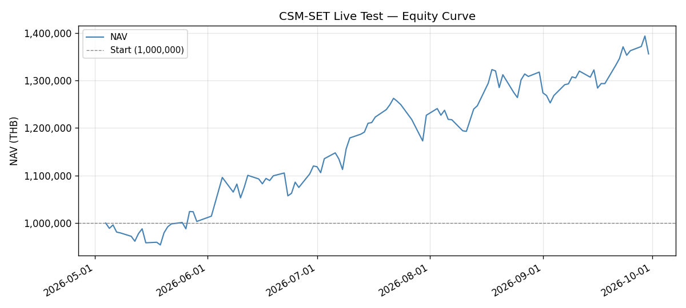
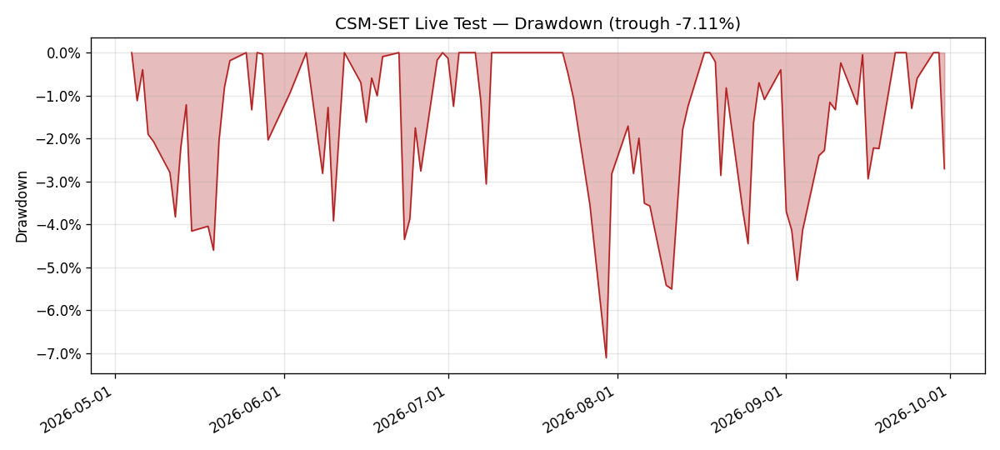
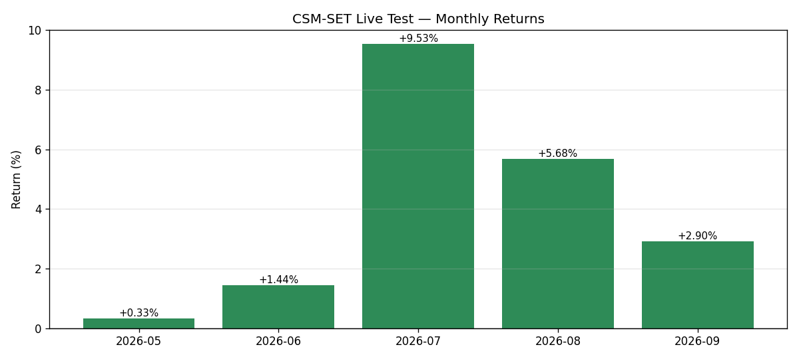
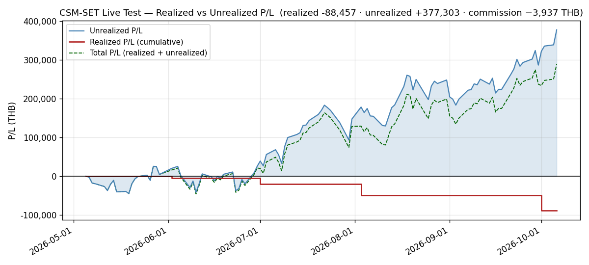

# Monthly Review — 2026-09 (September)

**Period:** September 2026 (live-test month 5, 22 trading days, Sep 1–30; no market closure in the month)
**Phase:** C — Stress Testing & Optimization (September–October). September is mid-phase; the Phase C reports fall due at the end of October.
**Status:** 🔴 **PRE-REGISTRATION HISTORY — SEEN, NOT SCORED.** The operator's 2026-09-11 decision restarts the track record forward-only, and **no scoring criteria have been pre-registered since** (checked for this review across the strategy repo, the ticket store and the umbrella). Every figure below carries that label, and nothing here is a benchmark, alpha or outperformance claim. NAV closed September at **1,355,771.70 THB**, up **+38,241.00 (+2.90%)** with **no trades and no capital flow**, so the reported change *is* the time-weighted return. Cumulative return on the 1,120,000 capital base is **+21.05%**. The month set an all-time NAV high of **1,393,443.70 on 2026-09-29** and gave back **−2.70%** on its final session. 🔴 **The October rotation is 1-out / 1-in on the live test's documented rules — SELL MGC (EMA100 exit), BUY CNT — and it carries TWO decisions for the operator before the 2026-10-01 ATO** (see Rebalance): **(1)** under the engine's own definition of the EMA100 exit, which differs from the live test's, the 2026-09-30 close would instead cut the whole book to **20% equity**; **(2)** MGC's proceeds fund CNT at only **4.43%** of NAV, below the 5% position floor, unless the shortfall is covered by a capital injection, as it was on 2026-08-03.

---

## Executive Summary

September opened on the live test's first no-trade rebalance (0-out / 0-in at the 2026-09-01 ATO) and ran **1,317,530.70 → 1,252,722.70 (low, 09-03) → 1,393,443.70 (all-time high, 09-29) → 1,355,771.70 (close)**: a −4.92% first three sessions, a +11.23% advance to the high over eighteen sessions, and a −2.70% final session. **13 sessions rose and 9 fell.** The largest single-session gain was **+38,710.00 (09-21)** and the largest loss **−43,649.00 (09-01)**.

**The month's gain came from one name.** KCE rose **+26.03%** (60.50 → 76.25) and contributed **+40,950.00 — 107% of the month's +38,241.00**. Without it September is a small loss. HANA (+11,250.00), IRPC (+9,056.00) and EASTW (+8,160.00) added the rest of the gains; **MGC (−11,040.00), INSET (−7,560.00) and FORTH (−7,420.00)** took the most. KCE ended the month with **the highest unrealized gain any holding has reached in the holding period (+95.19%)** and, on 09-30, became **the book's largest position for the first time**.

**Nothing was traded, so every constraint breach in September was drift, and there were more of them than in any prior month.** ENERG crossed the 35% sector cap on 09-09 and ETRON on 09-30; the AUTO sleeve (MGC alone) has been **below the 5% floor for thirteen consecutive sessions** since 09-14; INSET closed above the 15% position ceiling on four sessions. **None of these is enforced between rebalances by design**, and the month-end evaluation is where they meet the rules (Rebalance; `events/2026-09-09-sector-cap-and-position-band-drift.md`).

**The month's most consequential finding is a definition, not a return.** Preparing the rotation established that the "EMA100 fast exit" the live test applies — *sell a holding whose own close is below its own EMA100* — **is not the rule in the backtest engine**, where the same name refers to an **index** overlay: *if the SET closes below its EMA100 inside a BULL regime, scale the whole book to 20% equity*. On 2026-09-30 the SET closed **0.73% below its EMA100**. The two definitions give different answers at the 2026-09-30 close, and only one of them has ever been backtested (`events/2026-09-30-ema100-fast-exit-definition-conflict.md`).

---

## Performance Metrics

| Metric | Value | Target / Baseline | Status |
|---|---:|---|---|
| Month-open NAV (Aug 31 close) | 1,317,530.70 | — | — |
| Month-close NAV | **1,355,771.70** | — | matches the 2026-09-30 daily log exactly |
| Month change | **+38,241.00 (+2.90%)** | — | no capital flow |
| **Time-weighted return** | **+2.90%** | — | ✅ equals the reported change (no flow) |
| Cumulative return (1,120,000 base) | **+21.05%** | — | ✅ |
| Annualized Sharpe (flows stripped, n=102) | **1.8276** | ≥ 0.5 | ✅ on the TK-0568 basis; 1.9298 at 2026-08-31 |
| Realized volatility — since inception | **28.54%** ann. | ≤ 15% (warn > 20%) | 🔴 **breached**, as throughout the live test |
| Realized volatility — September | 1.64% daily (**26.11%** ann.) | ≤ 15% | 🔴 above target; below August's **30.77%** on the same flow-stripped basis (the August review's 30.88% counted the 08-03 injection day) |
| Max drawdown since inception | **−7.11%** (2026-07-30) | > −15% | ✅ unchanged |
| September max drawdown | **−5.80%** (09-03 vs the 08-18 peak) | — | ✅ |
| Drawdown at month-close | **−2.70%** (vs the 09-29 peak) | — | ✅ |
| Up / down sessions | **13 / 9** (59.1%) | — | — |
| Turnover — September executed | **0.00%** | ≤180% p.a. | ✅ no trades |
| **Turnover — October plan** | **4.40%** (option A) · **6.18%** (option B) | ≤180% p.a. | ✅ |
| Sector concentration (max) | **ETRON 35.0111%** at close; ENERG 35.2791% on 09-09 | ≤35% | 🔴 **two crossings, both drift** |
| Position bound | KCE **14.6227%** (max) · MGC **4.3768%** (min) | 5–15% | 🔴 MGC below the floor |
| Data completeness | **22/22** sessions | ≥ 95% | ✅ held data complete on all 22 |

**On the Sharpe and volatility figures.** Both are computed exactly as [[TK-0568]] corrected them: `db_gateway.daily_performance` from 2026-05-04, the two capital injections stripped from their days' returns, sample standard deviation, × √252 — a basis that reproduces the published **1.9298** at 2026-08-31 and **1.6164 / 29.39%** at 2026-09-07 to four decimals. **Five months of a concentrated ten-name book in one regime is too short a sample to estimate a Sharpe**; the figure is reported because the procedure asks for it. The volatility breach is the one metric in this table that is both large and stable: **28.54% against a 15% target** is not a sampling question.

---

## Performance vs Backtest Baseline

> 🔴 **Context for continuity, NOT a scored comparison.** Under the 2026-09-11 decision the live record is pre-registration history. The table below states the backtest's figures beside the live ones because the procedure requires the section; it does not claim that either outperforms the other.

| Measure | Live (5 months) | Phase 3.8 real-data backtest | Read |
|---|---:|---:|---|
| Return | +21.05% cumulative | CAGR **12.52%** | a 5-month window inside one BULL regime against a multi-year walk-forward — not comparable |
| Sharpe | 1.8276 (n=102) | **0.663** | not comparable at this sample size |
| Max drawdown | **−7.11%** | **−31.03%** | the live book has not met anything resembling the backtest's worst |
| Turnover | 0% (Sep), 4.4–6.2% (Oct plan) | ≤180% p.a. | inside |

**The concentrated ~10-name configuration is a higher-variance expression of the validated edge, not the validated edge itself.** The Phase 3.8 baseline is the **broad top-quantile book**; notebook 04's concentrated figures are on **synthetic** data and are not a baseline ([[TK-0570]]). ⚠️ **September adds a second reason the comparison is weaker than it looks: the live test and the backtest do not run the same EMA100 rule** (event report). A backtest that de-risked to 20% equity whenever the SET fell below its EMA100 is not the same strategy as a live book that exits individual names on their own EMA100.

---

## Rebalance (October 1 ATO)

**Evaluation date:** 2026-09-30 (last trading day of September). **Execution date:** 2026-10-01 (Thursday) ATO — confirmed a trading session against the banked SET holiday calendar (`captured_at 2026-09-30T08:48:09Z`), which carries no closure from 2026-09-30 through 2026-10-01; the next 2026 closure is 2026-10-13.

### Ranking inputs (reproduced from the engine)

- Composite = equal-weight mean of the six z-scored factor columns (`mom_12_1`, `mom_6_1`, `mom_3_1`, `mom_1_0`, `sharpe_momentum`, `residual_momentum`), which is what `PortfolioConstructor.select` averages (`construction.py`, `cross_section.mean(axis=1)`); percentile rank is `composite.rank(pct=True)`. **The verdict below was produced by calling `PortfolioConstructor.select()` itself** (n=10, floor 0.35, buffer 0.25), not a re-implementation.
- **204 ranked symbols** at 2026-09-30, from `features_latest.parquet` as written by the 2026-09-30 scheduled refresh (211 symbols fetched, `failures=0`, `index_fetched=true`), with no missing factor values. The cross-section includes **SET:THCOM on a restored 600-bar history**; its history had been served as two bars on 2026-09-29 and was back to full length before the evaluation's data were built.
- Exit rules as documented for the live test: rank floor **0.35** (unconditional), buffer **0.25**, **EMA100 fast exit (per holding: close < own EMA100)**, liquidity floor **5,000,000 THB** 63-day ADTV on any incoming name, sector cap **35%**. EMA100 is `ewm(span=100, adjust=False, min_periods=100)` on the panel's closes — the same construction as `RegimeDetector.compute_ema`.
- The engine was imported **without** reading the host's `.env`: the evaluation ran from a directory with no `.env`, with public mode on and DB writes off, so no live setting or credential was loaded.

### Current holdings — composite percentile rank (Sep 30)

| Holding | Universe rank | Composite pct-rank | Below 0.35 floor? | Challenger gap ≥ 0.25? | Close < own EMA100? |
|---|--:|--:|---|---|---|
| SMT | 2 | 0.995 | no | no (+0.005) | no (6.05 vs 4.5253, +33.69%) |
| KCE | 4 | 0.985 | no | no (+0.015) | no (76.25 vs 48.2581, +58.00%) |
| GUNKUL | 5 | 0.980 | no | no (+0.020) | no (5.10 vs 4.4941, +13.48%) |
| IRPC | 8 | 0.966 | no | no (+0.034) | no (2.84 vs 2.3087, +23.01%) |
| INSET | 10 | 0.956 | no | no (+0.044) | no (4.60 vs 4.1116, +11.88%) |
| HANA | 13 | 0.941 | no | no (+0.059) | no (51.00 vs 40.6109, +25.58%) |
| **MGC** | 24 | 0.887 | no | no (+0.113) | **YES (6.45 < 7.0013, −7.87%)** |
| EPG | 25 | 0.882 | no | no (+0.118) | no (6.10 vs 5.5321, +10.27%) |
| EASTW | 31 | 0.853 | no | no (+0.147) | no (5.20 vs 4.5689, +13.81%) |
| FORTH | 35 | 0.833 | no | no (+0.167) | no (14.60 vs 14.2381, +2.54%) |

**`PortfolioConstructor.select()` verdict (n=10, floor 0.35, buffer 0.25): 0 evicted, 10 retained.** The lowest-ranked holding is **FORTH at 0.833**; the best eligible challenger is **CNT at 1.000**, so the buffer bites below **0.750**, and FORTH clears it by **+0.083**. **The same verdict holds on the seven-factor reading** (all panel columns including `sector_rel_strength`): 0 evicted, lowest EASTW at 0.833 — so the composite-definition ambiguity recorded at the August review again changes nothing.

**One rule fires, on one holding: MGC closed 7.87% below its own EMA100** (6.45 against 7.0013). It is retained by the rank floor (0.887, #24 of 204) and by the buffer (+0.113 gap), and is evicted **solely by the EMA100 exit** — the same pattern as DELTA on 2026-08-03. The next-closest holding to its EMA100 is FORTH at **+2.54%**.

### Recommended October book — systematic 1-out / 1-in (SELL MGC, BUY CNT)

**SELL MGC — 9,200 shares.** EMA100 fast exit (6.45 < 7.0013, −7.87%). At the 09-30 close the sale grosses **59,340.00**, nets **59,240.31** after the 0.16799% fee, and realizes **−39,365.29 (−39.92%)** against the 98,605.60 cost basis. MGC entered on 2026-08-03, has not closed above its entry price since, closed at a holding-period low of 6.45 on the evaluation day, and is the whole of the AUTO sleeve that has been below the 5% floor since 09-14. **Its exit resolves the floor breach by removing the sleeve.** 63-day ADTV 72.02M THB.

**BUY CNT.** Universe rank **#1 of 204** on both the six- and seven-factor composites (composite **+2.506**, pct-rank **1.000**) — the top-ranked name not already held. SET-official sector **CONS** (from `universe_latest.parquet`), a sector the book does not hold. 63-day ADTV **11.10M THB**, 2.2× the 5M floor. 600 bars of history from 2024-04-03 with no gaps in the last 90. Close 3.30, **+42.22% above its EMA100**. Momentum: **+3.8% 1m, +106.8% 3m, +214.0% 12m**.

> ⚠️ **CNT is the thinnest entrant the live test has bought.** Its 11.10M ADTV compares with 80.36M (SMT) and 45.36M (MGC) at their entries, and its thinnest day in the last 63 turned over only **0.39M THB**. The order (60,060 or 108,240 THB) is 0.5–1.0% of average daily value, so it is fillable, but an ATO print on a thin name can gap: the cash left after each option covers CNT up to **+3.5%** above 3.30. It clears every documented screen; this is recorded as a characteristic, not an objection.

### 🔴 Decision 1 for the operator — which EMA100 rule

| Reading | Where it is defined | Verdict at the 2026-09-30 close |
|---|---|---|
| **Per holding: close < own EMA100 → sell that name** | the live test's rules (`README.md`, this skill, `configs/live-settings.yaml`, which no code reads — [[TK-0566]]); applied by hand at every rebalance, and what evicted DELTA on 2026-08-03 | **SELL MGC** (1-out / 1-in) |
| **Index: SET < EMA100 inside BULL → equity × 0.20** | the backtest engine (`backtest.py::_is_fast_exit`, `sector_regime_constraint_engine.py`), i.e. the rule behind the Phase 3.8 figures | SET **1,559.01 < EMA100 1,570.4464 (−0.73%)**, EMA200 1,504.1862 (BULL) → **scale the book to 20% equity**: sell about **1,081,589.66 THB**, 79.96% of every position, roughly **1,817 THB** of fees, and realize about **229,050 THB** of the unrealized gain at the 2026-09-30 close |

**Recommendation: execute the per-holding rule for October, and settle the definition for the forward record rather than on the day it bites.** It is the rule this live test has run at every rebalance since May, and it is the one the published trade record already embeds. Switching definitions at the one moment the switch would change the trade would be a discretionary override, and that would contaminate the record this test exists to produce. **But the per-holding rule has never been backtested** — [[TK-0277]] records that it is applied by hand outside `src/csm/` — so the README's statement that the live exit mechanisms "match the Phase 3.8 backtest design exactly" is false for this row and is corrected in the same commit. Which definition the forward record uses belongs with the pre-registration that the 2026-09-11 decision left pending.

### 🔴 Decision 2 for the operator — how CNT is sized

MGC's net proceeds plus cash are **62,268.01 THB, 4.59% of NAV**. That is too little to seat CNT inside the 5–15% position band.

| | Option A — self-funded | Option B — 2026-08-03 precedent |
|---|---|---|
| CNT order | **18,200 shares** @ ~3.30 = 60,060.00 (+100.89 fee) | **32,800 shares** @ ~3.30 = 108,240.00 (+181.83 fee) |
| Capital injection | none | **+50,000.00 THB** (`starting_nav` 1,120,000 → **1,170,000**; breaker trip 1,064,000 → **1,111,500**) |
| Cash after fills (at indicative prices) | 2,107.12 | 3,846.18 |
| CNT weight | **4.43% — below the 5% floor at entry** | **7.70%** (the ~8% entry sizing used on 2026-07-31) |
| ETRON after the trade | **35.02% — still over the cap** | **33.77% — under the cap** (diluted by the injection) |
| Positions outside 5–15% | CNT | none |
| One-way turnover | 4.40% | 6.18% |
| Commission (both legs) | 200.58 | 281.52 |

**Option B is the only one that leaves every construction constraint satisfied**, and it is what the live test did the last time the exits did not fund the entrants (2026-08-03, 20,000 THB). **It is also a capital decision, and only the operator can make it.** Without a yes, Option A is the rule-consistent fallback, and CNT then enters below the floor, recreating the position MGC is being sold from.

**Trade list (2026-10-01 ATO), prices indicative at the 2026-09-30 close:**

| Side | Symbol | Shares | Indic. price | Triggering rule |
|------|--------|-------:|-------------:|-----------------|
| SELL | MGC | 9,200 | ~6.45 | EMA100 fast exit (per holding: 6.45 < 7.0013, −7.87%) |
| BUY | CNT | **18,200 (A) / 32,800 (B)** | ~3.30 | top eligible composite (#1, 1.000), CONS, ADTV 11.10M |

**Resulting book (option B at indicative prices, SET-official sectors):** ETRON 33.77% (HANA, KCE, SMT) · ENERG 31.49% (GUNKUL, IRPC, EASTW) · ICT 19.25% (INSET, FORTH) · CONS 7.70% (CNT) · CONMAT 7.51% (EPG). **AUTO leaves the book with MGC.** On the backtest engine's sector-cap basis (`backtest.py::_apply_sector_cap`, an equal-weight name count on the constructed target), no sector exceeds 3 of 10 names (30%) under either option.

**Realized P/L and commission if the trades fill at the indicative prices:** realized **−39,365.29** on MGC, taking the cumulative from −49,091.38 to **−88,456.67 THB**; commission **+200.58 (A) / +281.52 (B)**, taking the cumulative to **3,935.74 / 4,016.68 THB**. **Record the executed figures from the broker confirmations, not these.** `configs/live_portfolio.yaml` is **not** edited by this review; it changes only after the fills, with commission-inclusive `avg_cost` at 4 decimals and the new cash, as at every prior rotation.

---

## P/L Split

| Metric | This month | Since inception |
|--------|----------:|----------------:|
| Realized P/L | **0.00** | **−49,091.38** |
| Unrealized P/L | **+38,241.00** | **+286,473.35** |
| **Total P/L** | **+38,241.00** | **+237,381.97** |
| Commission paid | **0.00** | **−3,735.16** |

- **Realized did not move, because September traded nothing.** The 2026-09-01 rebalance was 0-out / 0-in. The October rotation will move it (Rebalance above).
- **Commission ledger, unchanged:** 1,611.15 (05-05) · 984.44 (06-02) · 169.09 (06-04/05) · 287.83 (07-01) · 682.65 (08-03) = **3,735.16** cumulative.
- **Commission is already inside the other rows** — buy-side capitalised into cost basis, sell-side netted out of realized. Never subtract it from NAV a second time.
- **Quote commission against both denominators.** 3,735.16 is **0.28% of NAV** and **7.6% of the 49,091.38 cumulative realized loss**. If MGC is sold near 6.45 the realized loss roughly **doubles** to about −88,457, and the second ratio **falls** to about 4.5% — a smaller share of a bigger loss, not cheaper friction.
- **A negative cumulative realized alongside a positive total is the design working**: losers are banked at rebalance, winners ride. MGC is the clearest instance yet — a −39.92% position exiting by rule while KCE rides at +95.19%. Escalate only if the *total* stalls; it advanced **+38,241.00** in September.

**P/L identity:** `realized_cum + unrealized − (NAV − starting_nav)` = −49,091.38 + 286,473.35 − 235,771.70 = **1,610.27 THB**, **constant on all 22 September sessions** (checked row by row against `graphs/pnl.csv` and `daily_performance`). It will step again at the October rotation, as it did at 2026-08-03, by the 4-dp `avg_cost` rounding of the entrant.

---

## Drawdown & Risk

| Metric | Value | Threshold | Status |
|---|---:|---|---|
| Drawdown at month-close | **−2.70%** (vs the 09-29 peak 1,393,443.70) | — | ✅ |
| September max drawdown | **−5.80%** (09-03, vs the 08-18 peak 1,329,825.70) | — | ✅ |
| Max drawdown since inception | **−7.11%** (2026-07-30) | −10% circuit breaker | ✅ never approached |
| Circuit breaker | **Inactive** | trips at **1,064,000** (5% of 1,120,000) | ✅ buffer **+291,771.70 / 21.52%** |
| Sector concentration | **ETRON 35.0111%** · ENERG 32.6474% | ≤35% | 🔴 ETRON over by **149.91 THB** |
| Sector floor | **AUTO 4.3768%** | ≥5% | 🔴 8,448.59 under, thirteenth session |
| Position bound | KCE 14.6227% (max) · MGC 4.3768% (min) | 5–15% | 🔴 MGC below |
| Liquidity | all ten holdings and the entrant clear the floor — thinnest held EASTW **23.32M**, entrant CNT **11.10M** (63-day ADTV) | ≥5,000,000 THB | ✅ |

🔴 **Four kinds of constraint breach in one month, all of them drift, none of them acted on — deliberately.**

| Constraint | Breach in September | Sessions |
|---|---|---|
| Sector cap 35% | **ENERG 35.2791%** (09-09); **ETRON 35.0111%** (09-30, crossed on a *falling* NAV — the sleeve's value fell 5,980.00 while the cap fell 13,185.20) | 2 |
| Sector floor 5% | **AUTO** (MGC) from 09-14 to 09-30, deepest 8,448.59 THB under | 13 |
| Position ceiling 15% | **INSET** on 09-03, 09-04, 09-18 and 09-22 | 4 |
| Position floor 5% | **MGC** — the same sessions as AUTO | 13 |

**No discretionary trim or top-up was recommended at any point and none has been sized.** The bands are documented as rebalance-construction constraints, and there is no code path that enforces drift ([[TK-0279]]). A hand-placed correction would be a model deviation. **The October rotation resolves two of the four by rule** (MGC and its AUTO sleeve leave); option B also brings ETRON back under the cap by dilution. The question underneath — *do the bands govern drift, or only construction?* — is still the operator's, and September gave it instances at every end. See `events/2026-09-09-sector-cap-and-position-band-drift.md`.

**Concentration is genuine.** The two large sleeves held **67.66% of NAV** at the close, their highest of the holding period, and the top four positions (KCE, INSET, IRPC, GUNKUL) **52.31%**. That is the intended shape of a ~10-name book and is why its realized volatility runs near twice the 15% target. **The vol-scaling overlay is not applied in the live test** — a standing configuration difference from the backtest, recorded again rather than treated as a defect.

---

## Regime Summary

| Indicator | Aug 31 | Sep 30 | Change |
|---|---:|---:|---|
| SET Index | 1,595.16 | **1,559.01** | −36.15 (**−2.27%**) |
| SET 200-day SMA | 1,449.6623 | **1,484.1103** | +34.4480 (+2.38%) |
| Cushion (SET vs SMA200) | +10.04% | **+5.05%** | **−4.99 pp** |
| Regime | BULL | **BULL** | no transition |
| SET vs its EMA100 (engine overlay input) | — | **−0.73%** (1,559.01 vs 1,570.4464) | **below — see Decision 1** |

**No regime transition occurred**; the book was in BULL on all 22 sessions, and at the close the SET would need to fall **74.90 points (−4.80%)** to reach its SMA200. **The cushion compressed −4.99 pp, a larger monthly compression than August's −4.44 pp**, and for the second month running both halves pushed the same way: the mean rose +2.38% while the index fell −2.27%. The 2026-09-30 session alone removed 2.48 pp — **the index's worst session since 2026-03-23** (−2.2135%).

**The regime filter is evaluated at the month-end rebalance and was evaluated on 2026-09-30: BULL, no transition.** The engine's faster overlay reads differently: the SET closed below its **EMA100** on 2026-09-30, as it also did intra-month on 09-16 (not a rebalance date, so not evaluated). Both the daily logs' SMA200 and the engine's EMA200 (+3.64%) agree on BULL. **The index's margin over its EMA100 at each month-end evaluation fell every month: +9.00% (05-29), +7.27% (06-30), +6.04% (07-31), +2.46% (08-31), −0.73% (09-30).**

---

## Charts

All four are current to 2026-09-30. `nav_actual.csv` and `nav_twr.csv` were extended **80 → 102 rows**, and **the 80 previously committed rows are byte-identical** in both. The three NAV charts were regenerated by the documented two-run recipe, and `pnl_realized_unrealized.png` is the one the 2026-09-30 daily log regenerated from `pnl.csv` (102 rows).

**Verified before publishing, against the rendered images:** the monthly-returns bars read **May +0.33% · Jun +1.44% · Jul +9.53% · Aug +5.68% · Sep +2.90%**, the four prior bars identical to the published values. September carries no capital flow, so the TWR bar and the actual-NAV figure agree. The equity curve ends at **1,355,771.70** on 2026-09-30, and the drawdown chart's trough label still reads **−7.11%**.

⚠️ **One deliberate deviation from the documented recipe, and why.** The recipe builds `nav_actual.csv` as a straight dump of `db_csm_set.equity_curve`. **IRPC's 2026-09-09 ex-dividend restatement rewrote every `equity_curve` row from 2026-08-03 to 2026-09-08**; the September rows among them now sit 2,018.85 to 2,476.75 THB below what the daily logs published. Appending them after the committed (unrestated) 2026-08-31 row would put a **2,476.75 THB step that is not a return** at the month boundary. **The September rows were therefore taken from `db_gateway.daily_performance`**, the published basis; the two sources agree on every row from 09-09 onward, including the month's end. The TWR series is the same rows × k₁ × k₂ (0.9087563918 × 0.9839712855), neither factor re-derived. Recorded in `graphs/README.md`.

⚠️ **The drawdown chart and this review measure September's trough on different bases.** The chart's committed August rows are the restated `equity_curve` values of their day, so it shows September's worst at about −5.3%. This review quotes **−5.80%** on the published basis, which is the basis the August review used (−4.73%). The since-inception trough (−7.11%, 2026-07-30) predates every restatement and is the same on both.

---

## Significant Events

Two new event reports, both **model deviations**:

- [`events/2026-09-30-ema100-fast-exit-definition-conflict.md`](../events/2026-09-30-ema100-fast-exit-definition-conflict.md) — the live test's per-holding EMA100 exit is not the engine's index overlay, and on 2026-09-30 the two disagree about the whole book.
- [`events/2026-09-09-sector-cap-and-position-band-drift.md`](../events/2026-09-09-sector-cap-and-position-band-drift.md) — two sector-cap crossings, a thirteen-session sector-floor breach and four position-ceiling sessions, all drift, none enforced.

Already filed during the month: [`2026-09-01-dual-bar-nav-corruption.md`](../events/2026-09-01-dual-bar-nav-corruption.md) (fixed the same evening) and [`2026-09-10-host-hang-and-unclean-reboot.md`](../events/2026-09-10-host-hang-and-unclean-reboot.md) (no refresh missed). **No regime transition occurred**, so no regime event is filed.

---

## Notes / Data Quality

**Infrastructure.**

- 🟢 **22 of 22 scheduled refreshes fired on time**, none manually triggered. **Held-symbol data was complete on all 22.** Three sessions needed a universe retry that recovered (09-11, 09-21, 09-22). One ended with a universe symbol unfetched: **2026-09-28, `SET:THCOM`, not held** — the first `failures>0` receipt since 2026-07-31. Durations ran 122.663–332.012 s; the longest was that 09-28 run, three retry attempts included.
- ⚠️ **The THCOM episode was a vendor history reset and resolved itself before the evaluation.** On 09-28 every attempt drew a symbol `resolve error`; on 09-29 the vendor served THCOM as **two bars**; on 09-30 it served **600**. The restored history **agrees exactly** with the banked raw store on the 563 bars they share. It changed nothing held and nothing ranked, but on a different day it would have removed a name from the evaluation's universe without any error.
- 🟢 **The 2026-09-01 dual-bar NAV corruption** (a second daily bar zeroed seven holdings in the live NAV) **was fixed, deployed and repaired the same evening** — event report linked above. Every September NAV in this review is on the repaired rows.
- 🟢 **`daily_return`'s denominator defect was fixed in the gateway on 2026-09-02** and agreed with the logs' own headline on every later session. The 112 legacy rows and the backfill-vs-cutover choice remain open ([[TK-0489]]).
- ⚠️ **Two host reboots, neither costing a refresh.** 2026-09-10 was an unplanned hang and hard reset (event report linked above). **2026-09-23 was operator maintenance** (kernel update, two clean shutdowns): the container restarted with the host, was not recreated, and the 18:00 firing ran normally.
- ⚠️ **Carried, unacted:** the container publishes `:8100` on all interfaces with `CSM_API_KEY` absent and `CSM_PUBLIC_MODE=false`. LAN-scoped, no broker credential, no order path. Binding it to `127.0.0.1` needs a container recreate and belongs in its own window.

**Data and reporting defects, carried.**

- **Restatement scope grew to 7 of 10 held names** with IRPC's 2026-09-09 ex-dividend, and the uncredited dividend total rose **6,663.00 → 8,927.00 THB** (IRPC +2,264.00). There is still no dividend-accrual path in the live-test book. The consequence for this review is the chart-basis choice above.
- **`equity_curve` and `daily_performance` agreed on the latest row for sixteen consecutive sessions** to 2026-09-30. That is agreement on the day, not on history: `hooks.py` rewrites the whole `[entry_date, today]` window on every refresh ([[TK-0297]]).
- **The strategy still reports zero trades and zero commission to the platform** ([[TK-0565]]); the October rotation will be the fifth rebalance recorded only in prose unless that is fixed first.

**Open decisions carried into October** — six, two of them needed before the ATO:

1. 🔴 **EMA100 definition** (Decision 1) — *before the 2026-10-01 ATO*.
2. 🔴 **CNT sizing / capital injection** (Decision 2) — *before the 2026-10-01 ATO*.
3. The drift question at every end of the position and sector bands (four breach types in September).
4. Dividend accrual — 8,927.00 THB uncredited, 7 of 10 names restated.
5. Restate-vs-cutover for price history.
6. `fix-notional-not-shares` for entrants — sharpened by this month: the exit of a position that shrank to 4.4% cannot fund an entrant into the band, which is exactly what fixed notional would decide.

**Phase C.** September is the first month of Phase C. The phase's reports (`reports/slippage-audit.md`, `reports/parameter-review.md`) fall due at the end of October; **the slippage audit is the natural place to measure the October ATO fills**, since CNT is the thinnest entrant yet ([[TK-0571]]).
